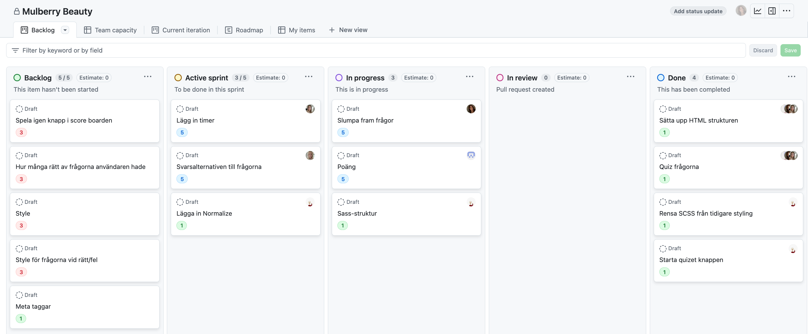
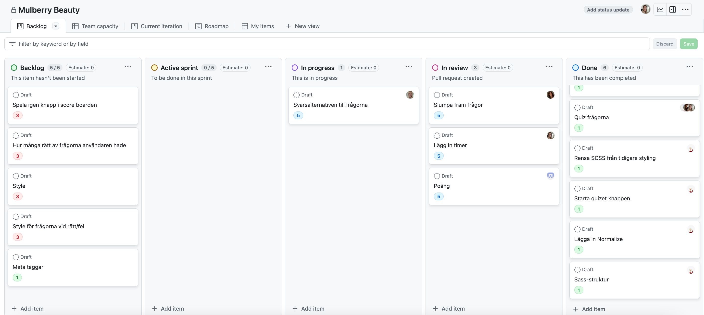
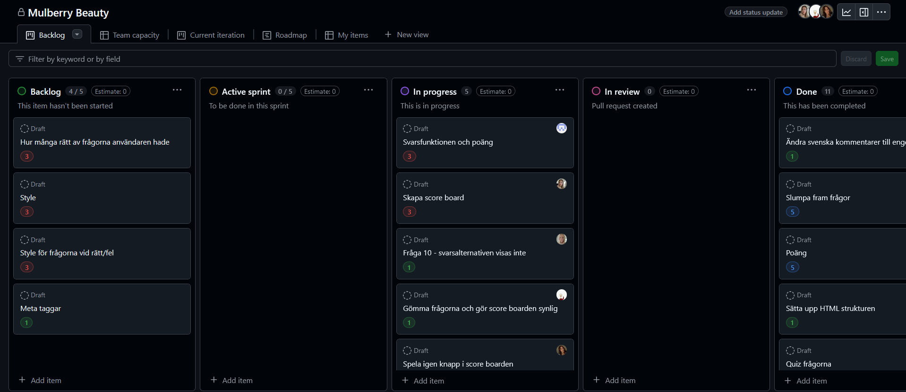
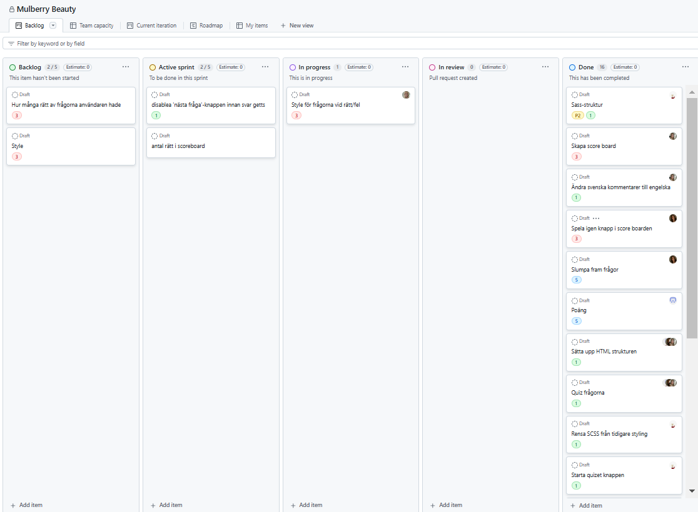
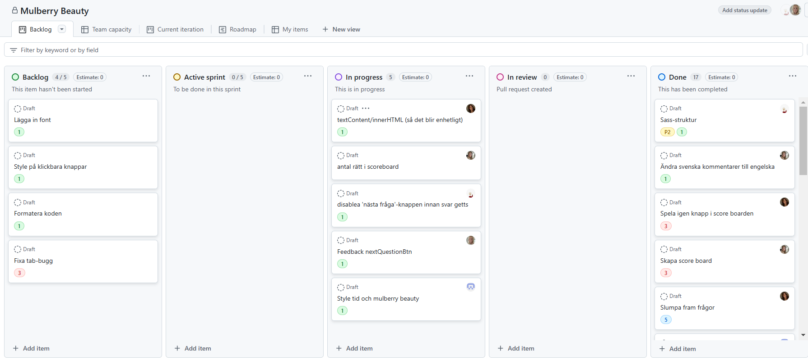
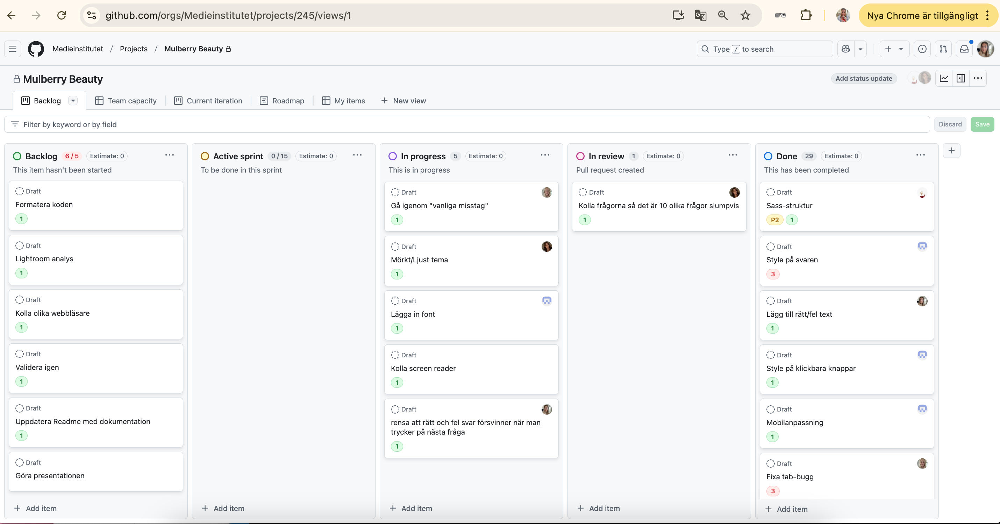
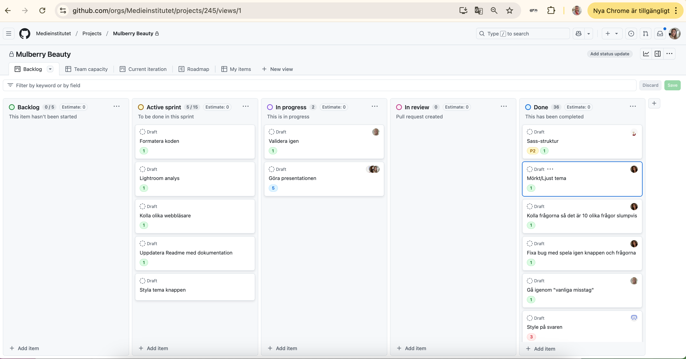
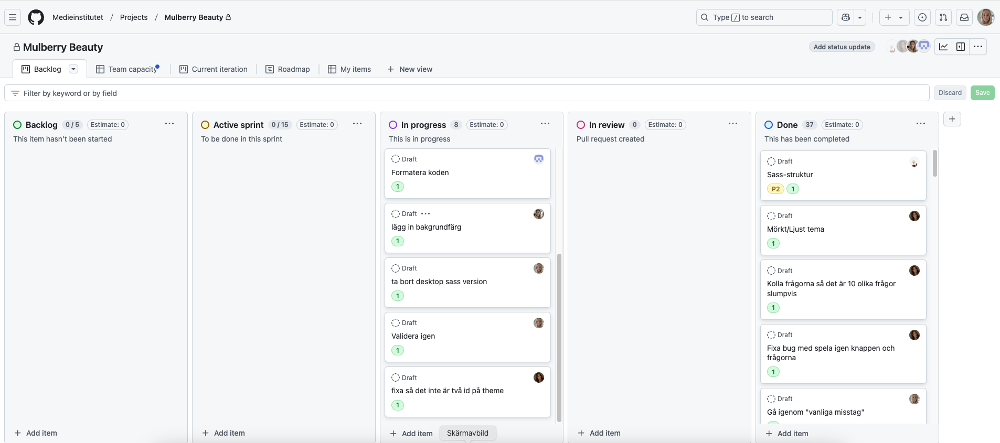
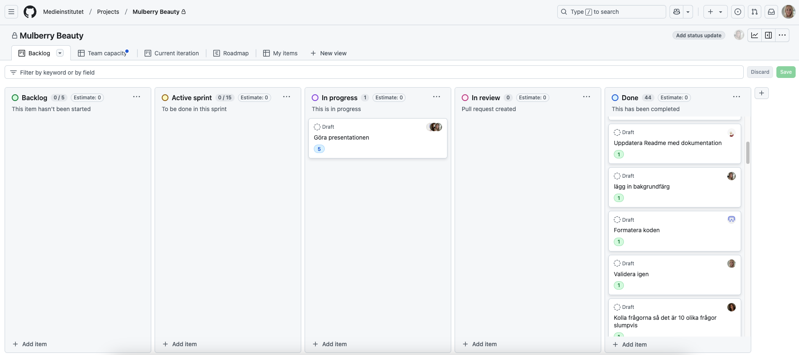

# Scrum-master

Vi kommer växla i gruppen mellan vem som är scrum-master, och dokumenterar här vår process.

## Tidsplanering

- 18 & 19 december = Maria
- 20 & 30 december = Jonatan
- 23 & 27 december = Ellinor
- 2 & 3 januari = Alexandra
- 7 & 9 januari = Alicia

---

### 18/12

#### Vad vi gjorde igår:

- Sprintplanering (Alla tillsammans)
- Grundläggande HTML-struktur (Alla tillsammans)
- Lägga in frågorna i projektet (Alla tillsammans)
- Kod för startknapp (Maria)

#### Vad vi ska göra idag:

- Påbörja kod för timern (Alexandra)
- Påbörja kod för svarsalternativ (Alicia)
- Påbörja kod för att slumpa fram frågor (Ellinor)
- Påbörja kod för poängräkning (Jonatan)
- Lägga in Sass-struktur, rensa tidigare styling, lägga in normalize & skapa scrum-logg (Maria)

#### Vad som kan hindra oss från att uppnå våra mål:

- Marias kod är inte pushad (Maria)
- Rensa tidigare styling och lägga in normalize-fil (Maria)
- Köra fast i hur man ska tänka med koden (avstämning över chatt senare på dagen)

---

### 19/12

#### Vad vi gjorde igår:

- Fixade Sass och CSS (Maria)
- Fixade timer (Alexandra)
- Funktion för svaren så att de visas (Alicia)
- Gjorde frågorna så de startar när man trycker på frågorna, och att de slumpas fram (Ellinor)
- Variabel för points och funktioner för att uppdatera poängen när man har valt rätt svar. När man trycker på play again så nollställs poängen (Jonatan)

#### Vad vi ska göra idag:

- Granska pull requests (Alla)
- Jämföra med Ellinors kod (Alicia)
- Se över timer-koden och byta ut placeholders (Alexandra)

#### Vad som kan hindra oss från att uppnå våra mål:

- Alicia & Alexandra väntar på kod för att kunna komma vidare - granska och pusha Ellinors kod så de kan komma vidare

---

### 20/12

#### Vad vi gjorde igår:

- (Alla) Reviewade pull requests och merga den kod vi har gjort, skapade Develop branch som vi nu mergar till innan vi mergar till main. Fixade buggar som gjorde att vi inte kunde publicera sidan.
- (Maria) Reviewa och hjälpa till med andras kod.
- (Alexandra) Fortsatte med timer koden och skapade en pull request för review.
- (Alicia) Se till att knapparna och funktionerna fungerar ihop med Ellinors kod.
- (Ellinor) Se till att knapparna och funktionerna fungerar ihop med Alicias kod.
- (Jonatan) Fixade bug och mergade poäng koden, började med att implementera det i resten av koden.

#### Vad vi ska göra idag:

- (Alla) Granska pull requests, fixa buggar.
- (Jonatan) Fortsätta med poäng funktionen, få det att uppdateras vid varje rätt svar och så att det inte går att ändra svar.
- (Alicia) Fixa så att svarsalternativen för fråga 10 visas.
- (Alexandra) Skapa innehållet för scoreboarden i TS.
- (Maria) Gömma frågorna och göra scoreboarden synlig efter 10 frågor har svarats på.
- (Ellinor) Se till att de 10 nya frågorna visas och att allt annat nollställs när man klickar på "Spela igen" knappen.

#### Vad som kan hindra oss från att uppnå våra mål:

- Ingenting för tillfället

---

### 23/12

#### Vad vi har gjort fram till idag:

- (Maria) Gömma frågorna och göra scoreboarden synlig när man svarat på 10 frågor.
- (Alexandra) Gjorde scoreboarden med antal rätt/fel, poäng, tid och knappen "spela igen".
- (Alicia) Meta taggar och började med iconerna för svarsalternativen vid rätt/fel.
- (Ellinor) Fixade "spela igen" knappen så att timer, poäng, frågorna och svarsalternativen visas igen om användaren trycker på knappen.
- (Jonatan) Fixade så att poängen fungerar med svarsalternativen korrekt och så att man inte kan ändra sitt svar efter man valt ett svar.

#### Vad vi ska göra idag:

- (Alla) Reviewade pull requests, löste conflicter som uppstod och merga den kod vi har gjort. Vi mergade även ihop develop branchen med main.
- Alla tar julledigt fram till fredag den 27 December!🎄
- (Ellinor) Merga develop branch till main.

#### Vad som kan hindra oss från att uppnå våra mål:

- Inget just nu.

---

### 27/12

#### Vad vi har gjort fram till idag:

- (Alla) Jullediga! 🎄
- (Alicia) La in iconer för rätt/fel svar.

#### Vad vi ska göra idag:

- (Alla) Förbereda oss inför avstämningspresentationen som är på måndag. Gå igenom feedback som vi fått och dela ut nya task samt merga in Alicias kod till develop, sen till main.
- (Ellinor) Ladda upp från develop till main. Ändra till textContent så det blir mer enhetligt.
- (Maria) Fixa "Nästa fråga" knappen så den inte går att trycka på om man inte valt ett svar.
- (Jonatan) Style på tid och titel.
- (Alexandra) Fixa så att antal rätt fungerar i scoreboarden.
- (Alicia) Fixar nextQuestionBtn så att den ligger som en variabel.

#### Vad som kan hindra oss från att uppnå våra mål:

- Inget just nu.

---

## Retro sprint 1

### Vad har gått bra?

- Kommunikationen har hållits på en hög nivå.
- Merging-processen har gått fort och effektivt då vi gjort det tillsammans.
- Vi bröt ner uppgifter ekkeftivt, vilket gjorde det enklare.

### Vad har gått mindre bra?

- Vissa tasks har varit dubletter i backloggen, vilket har varit förvirrande.

### Vad kan förbättras till nästa sprint?

- Fylla på backlog mer proaktivt och ha de tydligare med vad som ska göras.
- Se till att man inte skapar dubletter i backloggen.

### 30/12 - SPRINT 2 START

#### Vad vi har gjort fram till idag:

- (Ellinor) Ladda upp från develop till main. Ändra till textContent så det blir mer enhetligt.
- (Maria) Fixa "Nästa fråga" knappen så den inte går att trycka på om man inte valt ett svar.
- (Jonatan) Style på tid och titel.
- (Alexandra) Fixa så att antal rätt fungerar i scoreboarden.
- (Alicia) Fixar nextQuestionBtn så att den ligger som en variabel.

#### Vad vi ska göra idag:

- (Alla) Lägga upp ny sprintplanering och tillldela uppgifter.

Till nästa daily efter årsskiftet:

- (Ellinor) Se till att det faktiskt är 10 nya frågor under den andra omgången.
- (Maria) Validera HTML/CSS och sedan skriva en README.md för projektet.
- (Jonatan) CSS: Style på klickbara knappar, bättre mobilanpassning, bättre style på svaren och eventuallt lägga in ett nytt font.
- (Alexandra) Lägga in en text som visar om användaren har svarat rätt eller fel efter registrerat svar.
- (Alicia) Se till att tabbningen fungerar på sidan (a11y) och gå igenom "vanliga misstag" från tidigare projekt.

#### Vad som kan hindra oss från att uppnå våra mål:

- Inget just nu.

---

### 2/1

#### Vad vi har gjort fram till idag:

- (Alla) merga koden
- (Ellinor) fixat så att de kommer 10 nya frågor kommer när man trycker spela igen.
- (Maria) validera, README
- (Jonatan) styla svaren på frågorna, fixat klickbara knappar, stylat scorboard och ändrat fontstorlek i mobilen.
- (Alexandra) lagt till om man fick rätt eller fel
- (Alicia) fixat tab-bug, gått igenom "vanliga missar"

#### Vad vi ska göra idag:

- (Ellinor) mörkt/ljust tema
- (Maria) kolla skärmläsare så texten läser upp för blinda
- (Jonatan) ändra font
- (Alexandra) rensa att rätt och fel svar försvinner när man trycker på nästa fråga
- (Alicia) gör vanliga misstag

#### Vad som kan hindra oss från att uppnå våra mål:

- Inget just nu.

--

### 3/1

#### Vad vi har gjort fram till idag:

- (Alla) merga koden och förde över från develop till main
- (Ellinor) fixat mörkt/ljust tema fixade en bugg i frågorna
- (Maria) fixade så skärmläsare läser upp texten på sidan
- (Jonatan) la in en ny font som heter inter
- (Alexandra) rensa att rätt och fel svar försvinner när man trycker på nästa fråga
- (Alicia) gick igenom vanliga misstag

#### Vad vi ska göra idag:

- (Alla) förberett presentation
- (Jonatan) startar presentationen, om quizet och hur vi delat upp de
- (Maria) den agila processen
- (Alicia) tillgänglighet
- (Ellinor) kod som vi är nöjda med
- (Alexandra) slutresultatet

#### Vad som kan hindra oss från att uppnå våra mål:

- Inget just nu.

--

### 7/1

#### Vad vi har gjort fram till idag:

- (Alla) jobbat med sin del av presentationen
- (Ellinor) ändrat stavfel i kod
- (Alicia) gjort lighthouse-rapport

#### Vad vi ska göra idag:

- (Alla) fortsätta att förbereda sig inför presentation
- (Jonatan) formatera koden
- (Maria) uppdatera Readme med dokumentation
- (Alicia) kör validering igen & ta bort onödig desktop scss-fil
- (Ellinor) ta bort dubbelt id på theme i HTML & kolla quiz i olika webbläsare
- (Alexandra) ändra bakgrundsfärg

#### Vad som kan hindra oss från att uppnå våra mål:

- Inget just nu.

--

### 9/1

#### Vad vi har gjort fram till idag:

- (Alla) jobbat med sin del av presentationen
- (Ellinor) kollat quizet i olika webbläsare
- (Maria) uppdaterat Readme med dokumentation
- (Jonatan) formaterat koden
- (Alexandra) lagt in bagrundsfärg
- (Alicia) dubbelkollat validering, ändrat textfärg och tagit bort desktop scss-fil

#### Vad vi ska göra idag:

- (Alla) fortsätta att förbereda sig inför presentation vid behov

#### Vad som kan hindra oss från att uppnå våra mål:

- Inget just nu.

